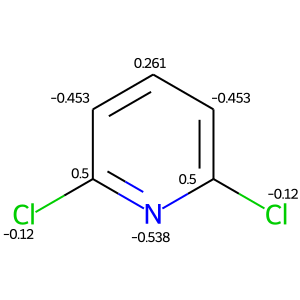
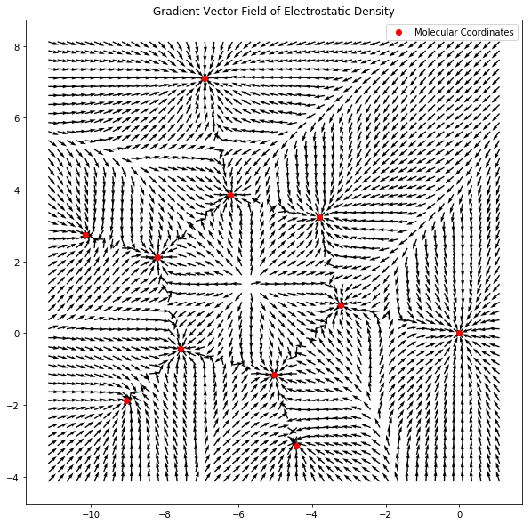
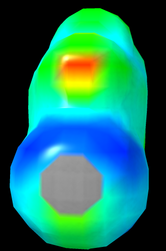
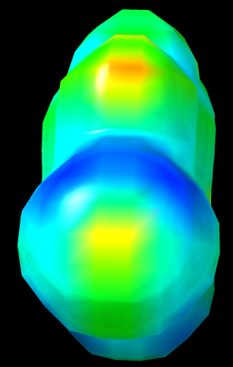

# Google Summer of Code 2021: Exploring Alternative Visualizations for OpenChem QCDevs
Nathan Wood, Year 4 Undergraduate, Microbiology and Cell Science, University of Florida

This project was prepared under the advisory of Dr. Farnaz Heidar-Zadeh, Dr. Paul Ayers, and Dr. Esteban Vohringer-Martinez 

## Note: Submitted Work
All work pertaining to objectives has been linked within the Results section.

For ease of access, links can also be found below:

[Python Function of ChimeraX Isosurface Visualization](https://github.com/nwoodweb/chemtools/blob/master/examples/esp/chimerax_vis_esp.py)

[Jupyter Notebook of 3D Annotation](https://github.com/nwoodweb/chemtools/blob/master/examples/annotate_3D/3DimensionAnnotation.ipynb)

[Python Script of 3D Annotation](https://github.com/nwoodweb/chemtools/blob/master/examples/annotate_3D/3DimensionAnnotation.py)

[Jupyter Notebook of 2D Annotation](https://github.com/nwoodweb/chemtools/blob/master/examples/annotate_2D/2DAnnotate.ipynb)

[Python Script of 2D Annotation](https://github.com/nwoodweb/chemtools/blob/master/examples/annotate_2D/2DAnnotate.py)

[Jupyter Notebook of Both Vector and Scalar Qualities](https://github.com/nwoodweb/chemtools/blob/master/examples/plotting/2D_Plotting_Gradient.ipynb)

[Python Script of Field Plot](https://github.com/nwoodweb/chemtools/blob/master/examples/plotting/plotVectorField.py)

[Python Script of Contour Plot](https://github.com/nwoodweb/chemtools/blob/master/examples/plotting/plotScalarContour.py)

## Introduction
OpenChem wishes to implement a means of visualizing Chemtools data. Such
means include exploring viable alternatives to Visualizing Molecular
Dynamics as a visualization platfrom. Further visualization goals
include the plotting of gradient vector fields and annotation of
molecules. Additionally, ChimeraX, developed by the University of
California, San Francisco, was chosen as a general purpose alternative
for VMD, with regards to visualizing isosurfaces as well as molecular
annotations.

## Goals

### Visualizing Electrostatic Potential Isosurfaces
  We wish to examine alternatives to Visualizing Molecular Dynamics (VMD) to visualize isosurfaces of molecules computed by Chemtools. Examples of VMD Alternatives include Avogadro/Avogadro2, ChimeraX, IQMol, JMol/JSMol, and PyMOL. 

### 3D Annotation of Molecules
  We wish to devise a means of taking IOData output, such as electrostatic potential charges, and applying these values as text annotations in a molecule rendered in a three dimensional environment.                        

### 2D Annotation of Molecules
  We wish to implement a means of not only visualizing a given molecule originating from a Gaussian Checkpoint file (fchk), but also annotating a 2-dimensional representation of this molecule using data from IOData.

### Plotting of Vector and Scalar Qualities of Molecules 
  We wish to develop a means of visualizing the computation of both scalar and vector qualities of molecules.

### Molecular Graphs of Bond and Ring Critical Points 
  We wish to implement a means of visualizing the bond and ring critical points of a given molecule.

## Results
### Visualizing Electrostatic Potential Isosurfaces

[Python function can be found here](https://github.com/nwoodweb/chemtools/blob/master/examples/esp/chimerax_vis_esp.py)

A script, consolidated as function `print_chimerax_isosurfaces`, has
been written, and accomplishes the following actions within the ChimeraX
Environment:

-   Open our surfaces file, generically named `*_rho.cube`

-   Open our map file, which allows us to color the surfaces,
    generically named `*_esp.cube`

-   Set to isosurface levels to visualize

-   Set the lighting, shadows, surface material appearance (ie dull or
    shiny), and representation (ie sufraces or meshes)

-   Set a color palette, both custom or built into ChimeraX

-   Set the minimum `scalemin` and maximum `scalemax` value range for
    colorizng the surfaces, or allow ChimeraX to determine the most
    suitable range using the string `'compute'` for both the `scalemin`
    and `scalemax` parameters within the script

### 3D Annotation of Molecules

[Jupyter Notebook of 3D Annotation](https://github.com/nwoodweb/chemtools/blob/master/examples/annotate_3D/3DimensionAnnotation.ipynb)

[Python Script of 3D Annotation](https://github.com/nwoodweb/chemtools/blob/master/examples/annotate_3D/3DimensionAnnotation.py)

IOData can output to Protein Data Bank (PDB) files, a text file that
enumerates monomer and a atomic data, such as element, XYZ cartesian
coordinates, and B Factor, which has historically been used to quantify
flexibility and freedom of motion in computational protein-ligand
docking. Originally, ChimeraX's Attribute Files, which allow a tab
separated table enumerating characteristics per unit, was conceived as a
means of annotating molecules as it was not considered to be a \"hack\"
and could allow multiple different annotations could be performed
without overwriting our PDB. However, this was abandoned due to the
complexity of assigning IOData values to an format ChimeraX finds
accessible.\

IOData possesses a feature known as `extra`, which allows writing in B
Factors when an intermediate PDB file is opened using IOData function
`load_one`, which can then be written to a finalized PDB file to be
loaded into ChimeraX. Once loaded, ChimeraX can visualize the B Factor
using its labeling utilities.

### 2D Annotation of Molecules

[Jupyter Notebook of 2D Annotation](https://github.com/nwoodweb/chemtools/blob/master/examples/annotate_2D/2DAnnotate.ipynb)

[Python Script of 2D Annotation](https://github.com/nwoodweb/chemtools/blob/master/examples/annotate_2D/2DAnnotate.py)

IOData is used to dump an XYZ and PDB files from the original Gaussian
Checkpoint (fchk) file. XYZ files are capable of being converted to
accurate SMILES strings via the Chemml utilities, however, the order of
the atoms being enumerated differs from that of IOData, making it
non-trivial to assign charges resulting from IOData's `atcharges` call.
On the other hand, PDB Files maintain the atomic order as IOData,
however, RDKit cannot visualize any pi bonds from the PDB. This is due
to the fact that PDB Files store pi bond data based on the distance
between atoms in cartesian space, whereas RDKit prefers bonds to be
explicitly detailed.

To address both issues, we can first correct the geometry of the PDB by
using RDKit's `Compute2DCoords` and then force the PDB to assume the
visualization stile of the afforementioned SMILES string using
`AssignBondOrdersFromTemplate`. Afterwards, the charges from IOData can
be assigned iteratively.

### Plotting of Vector and Scalar Qualities of Molecules 

[Jupyter Notebook of Both Vector and Scalar Qualities](https://github.com/nwoodweb/chemtools/blob/master/examples/plotting/2D_Plotting_Gradient.ipynb)

[Python Script of Field Plot](https://github.com/nwoodweb/chemtools/blob/master/examples/plotting/plotVectorField.py)

[Python Script of Contour Plot](https://github.com/nwoodweb/chemtools/blob/master/examples/plotting/plotScalarContour.py)

A Jupyter Notebook and function `plotVectorFieldOverPlane` were made
that is capable of plotting gradient vector fields. This was performed
by:

-   Using 3D rotate and scale operation against an affine plane, and then normalize to plot vector qualities against. 

-   Assigning our `vectorFunc` as as the vector quality we want to
    explore, in this case `mol.compute_gradient()`

-   Projecting our vector quality against the rotated affine plane

-   Visualizing the vector quality as a gradient vector field \"Quiver
    Plot\"

To plot a scalar quality, in this case electron density, we want to

-   Rotate an affine plane and normalize to plot scalar quality against 

-   Assign our `scalarFunc` which is a scalar quality of a molecule, in
    this case, electrostatic density

-   Visualizing the scalar quality as a contour plot, with our
    `scalarFunc` representing the level curves
    

## Post Mortem

### Administrative
While debug and deprecated code has been removed, parameters for functions need to be explicitly detailed

### Discrepancies between VMD and ChimeraX 
There is a discrepancy between appropriate values to display isosurface
levels between both ChimeraX and VMD. For the example
2,6-dichloropyridine, the previous VMD example recommends setting
`isoSurf` to .003 (left), however, in ChimeraX, this will produce a noticeable
uncolored void that can be corrected when setting `isoSurf` to .005 (right).

 

### Molecular Graphs 
The original goal of visualizing molecular graphs detailing the critical points of bonds and ring structures was not fulfilled

## Moving Forward
### Administrative
1. Code that has been consolidated into functions should have a more detailed explanation of use and parameters
2. Future GSOC internships should make further use of correspondence
methods such as Email, Github threads, Slack, and Zoom.

### Converting IOData Output into Chemical JSON 
In order to improve interoperability with Avogadro2, it will be
necessary to be able to output IOData and Chemtools data into a
\"Chemical JSON\" a form of JSON file that outlines chemical information
such as bonds, atoms, as well as charge and molecular/atomic orbital
data. While the formatting of basic data such as bonds and atoms is
nontrivial, considerable work will have to be done to correctly format
quantum chemistry data.

### Molecular Graphs
There remains the need to implement a means to visualize bond and ring critical points. 

## Special Thanks
I would like to extend great thanks to the following individuals for
assisting and granting me flexibility:

-   Farnaz Heidar Zadeh, Professor Queens University

-   Paul Ayers, Professor University of Toronto

-   Esteban Vohringer Martinez, Professor Universidad de Concepciòn

-   Victor Canogil

-   Toon Vestraelen

-   Gabriella S.D.

-   Ali Tehrani

-   Geoff Hutchinson, Avogadro2 Lead

-   Elaine Meng, PhD, ChimeraX Development Team, University of
    California San Francisco

-   Anthony Schaefer, PhD, ChimeraX Development Team, University of
    California San Francisco
